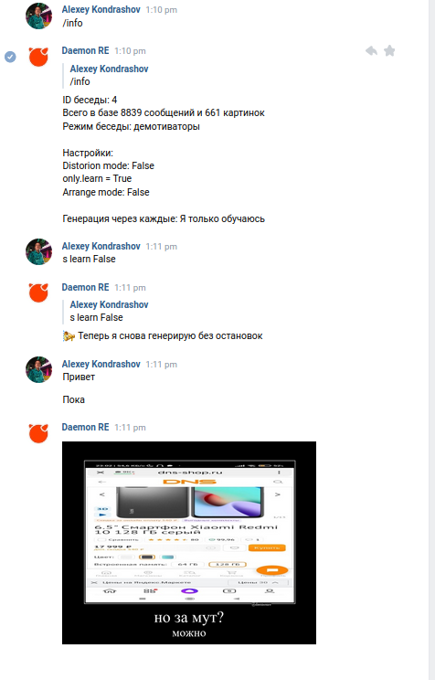

<h1 align="center">
  
</h1>

# Daemon RE

Daemon RE is an open bot in VKontakte that works using Markov chains. He generates messages or demotivators based on your chat messages and has many other commands.

# Demo

## Installation
1. Clone repository via `git clone https://github.com/Daemon-RE/daemon-re.git`
2. Install packages  `pip3 install -r requirements.txt` 
4. Write your token in [config.py](source/config.py)
5. Start bot via `python3 main.py`
6. Write your id in [admins.txt](source/Lists/admins.txt)
7. All necessary folders will be created by themselves, you only need to download the file `playerdata.db`, in the future you will not need to do this.
8. Go to the https://github.com/Daemon-RE/daemon-re-modules, and clone the modules package via `git clone https://github.com/Daemon-RE/daemon-re-module.git` and unzip it into the modules folder.
